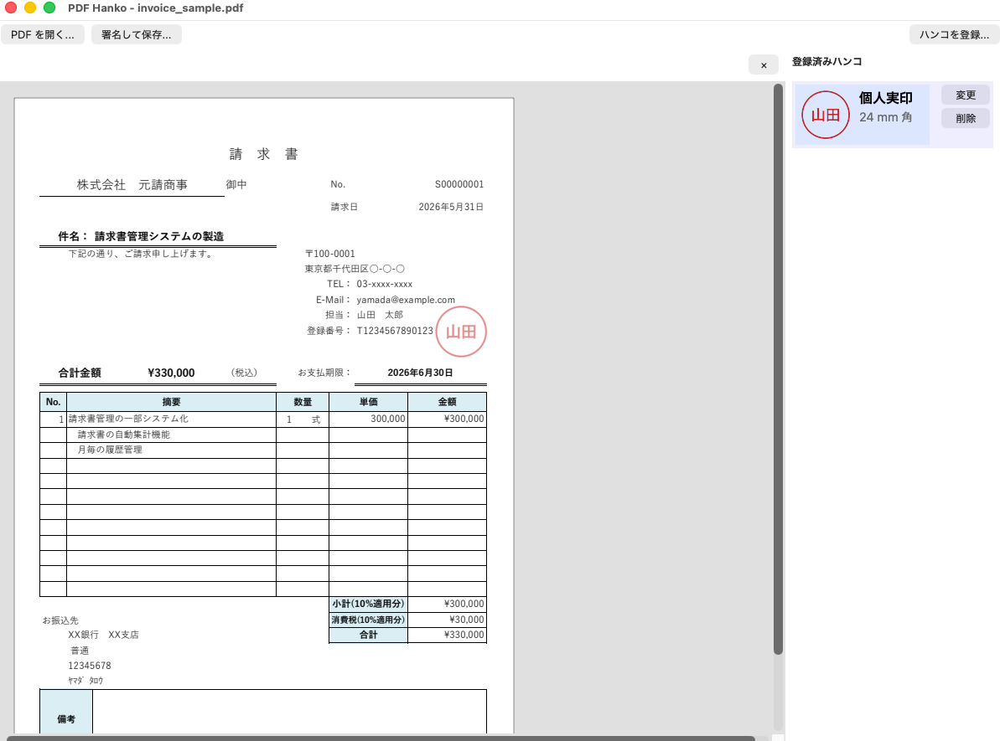

# PDF Hanko

[](LICENSE)

日本のハンコ文化に特化した、macOS 向けの PDF 電子署名アプリケーションです。

あらかじめ登録した印影画像と PKCS#12 形式の証明書を使い、PDF 上での
「押印」操作によって、見た目のハンコと PAdES 準拠の電子署名を同時に付与します。

> ⚠️ **本ソフトウェアは MIT ライセンスで「無保証 (AS IS)」で提供されます。**
> 「PAdES 準拠」は本アプリが生成する PDF 電子署名の技術仕様上の形式を示すものであり、
> 署名の法的有効性、本人性、証明書の信頼性、適格電子署名としての要件充足を保証する
> ものではありません。これらは、使用する証明書・運用方法・受領者側の
> 検証環境・適用される法令や契約条件などに依存します。重要な契約・法的書類に使用する
> 場合は、事前に十分な検証を行ってください。詳細は [LICENSE](LICENSE) を参照してください。

> 📝 開発の背景や使い方を [note の紹介記事](https://note.com/owlayer/n/n1f15473c066e) にまとめました。
> 本アプリを気に入っていただけた場合、記事の有料パート購入で開発の継続をご支援いただけると嬉しいです。



## 主な機能

- **ハンコ登録**: 印影画像、PKCS#12 証明書、名前、サイズを登録・編集・削除
- **PDF への押印**: PDF を表示し、ドラッグで押印位置を指定して、1 クリックで見た目のハンコと PAdES 電子署名を同時に付与
- **複数押印 / 再署名**: すでに署名済みの PDF にも追加で押印可能（甲乙押印、複数ページ押印に対応）
- **完全ローカル動作**: ネットワーク通信なし。PDF・印影・証明書・パスワードはすべて Mac 内のみで処理

## プライバシー

本アプリはいかなるネットワーク通信も行いません。すべてのデータ（PDF・印影画像・
証明書・パスワード）は利用者の Mac 内のみで処理され、外部に送信されることは
ありません。設定ファイルは `~/Library/Application Support/PdfHanko/` 配下に
保存されます。

PKCS#12 証明書のパスワードは永続化されず、署名処理中のみメモリに保持されます。

## 動作環境

- macOS（Apple Silicon / Intel 両対応）
- Python 3.11+（ソースから実行する場合に必要。`uv` が自動でセットアップします）

## ダウンロード

[Releases 一覧](https://github.com/owlayer-com/pdf-hanko/releases) から最新版の
`PDF Hanko-X.Y.Z.dmg`（約 60 MB）をダウンロードできます。通常はページ最上部の
"Latest" と表示されているリリースが最新版です。

### インストール手順

1. ダウンロードした `.dmg` をダブルクリックして開く
2. 表示されるウィンドウで `PDF Hanko.app` を `Applications` フォルダにドラッグ
3. `.dmg` をアンマウント（取り出し）
4. `Applications` から `PDF Hanko.app` を起動

初回起動時は macOS Gatekeeper の警告が表示されます。下記の
「[macOS Gatekeeper の警告について](#releases-からダウンロードして使う場合-macos-gatekeeper-の警告について)」
を参照してください。

## 事前準備

「ソースから実行する」「`.app` バンドルを自分でビルドする」場合は、いずれも
パッケージマネージャの [uv](https://github.com/astral-sh/uv) が必要です。
uv は本プロジェクトの依存関係の解決、仮想環境の管理、Python ランタイムのセットアップを
すべて担当します。

> ℹ️ リリース版の `.dmg` をダウンロードして使うだけなら uv は不要です。

### Homebrew でインストール（推奨）

```bash
brew install uv
```

### 公式インストールスクリプトでインストール

Homebrew を使わない場合：

```bash
curl -LsSf https://astral.sh/uv/install.sh | sh
```

詳細は [uv 公式ドキュメント](https://docs.astral.sh/uv/) を参照してください。
uv は Python ランタイム自体も管理するため、別途 Python をインストールする
必要はありません。

## インストール / 実行

### ソースからの実行（推奨）

```bash
git clone https://github.com/owlayer-com/pdf-hanko.git
cd pdf-hanko
uv sync
uv run python -m pdfhanko
```

### `.app` バンドルを自分でビルド

[Briefcase](https://briefcase.readthedocs.io/) を利用します（`pyproject.toml`
に設定済み）。

```bash
uv run briefcase create macOS
uv run briefcase build macOS
uv run briefcase run macOS
# .app バンドルは build/pdfhanko/macos/app/ 配下に生成される
```

### Releases からダウンロードして使う場合: macOS Gatekeeper の警告について

GitHub Releases に添付されている `.dmg` には **Apple Developer ID 署名が
付与されていません**。そのため、`.dmg` を開いた後に展開された `PDF Hanko.app`
を初回起動するとき、macOS の Gatekeeper による警告（「開発元が未確認のため
開けません」など）が表示されます。

これは本アプリに限らず、署名されていない macOS アプリで発生する一般的な挙動です。
起動方法は以下の通りです：

#### 方法 1: 右クリックから開く（macOS Sonoma 14 以前で有効）

1. `.dmg` を開き、`PDF Hanko.app` を `Applications` フォルダにドラッグしてインストール
2. Finder で `Applications/PDF Hanko.app` を **右クリック（または control + クリック）**
3. メニューから「**開く**」を選択
4. 警告ダイアログで「**開く**」をクリック

一度この手順を実行すれば、以降は通常通り Dock / Launchpad からダブルクリックで
起動できます。

#### 方法 2: システム設定から許可（macOS Sequoia 15 以降で必要になることが多い）

新しい macOS では方法 1 が制限されることがあるため、システム設定からの許可が必要です：

1. `.dmg` を開き、`PDF Hanko.app` を `Applications` フォルダにドラッグしてインストール
2. 通常通り `PDF Hanko.app` をダブルクリックする → 警告が表示される（OK を押して閉じる）
3. **アップルメニュー → システム設定 → プライバシーとセキュリティ**
4. 画面を下までスクロールすると、「"PDF Hanko" は開発元を確認できないため使用が
   ブロックされました」という表示の右に「**このまま開く**」または「**開発元にかかわらず開く**」
   というボタンがあるのでクリック
5. Touch ID または管理者パスワードで認証
6. 再度 `PDF Hanko.app` をダブルクリックすると起動できる

#### 方法 3: 自分でソースからビルドする（内容を確認しやすい方法）

警告を回避する最もシンプルな方法は、自分でソースからビルドすることです。
上記「ソースからの実行」または「`.app` バンドルを自分でビルド」の手順に従って
ください。コードは公開されているため、内容を確認したうえで利用できます。

> ℹ️ 商用アプリのように毎回 Developer ID 署名と Apple の公証を行う運用は、本 OSS
> プロジェクトでは行っていません。これが気になる方は、ソースから自分で
> ビルドして利用することを推奨します。

## 使い方

1. アプリを起動する
2. 「ハンコを登録...」から印影画像と PKCS#12 証明書を登録する
3. 「PDF を開く...」で署名対象の PDF を選ぶ
4. 右ペインのハンコをクリックして選択する
5. PDF 上で押印したい位置までマウスをドラッグ → 離した位置に押印プレビューが表示される
6. 「署名して保存...」をクリック → 保存先・パスワード入力 → 完了

## 開発

- GUI フレームワーク: [Toga / BeeWare](https://beeware.org/)
- PDF レンダリング: [pypdfium2](https://github.com/pypdfium2-team/pypdfium2)
- 電子署名: [PyHanko](https://github.com/MatthiasValvekens/pyHanko)
- パッケージング: [Briefcase](https://briefcase.readthedocs.io/)

### ディレクトリ構成

```
src/pdfhanko/
├── app.py              # toga.App 本体
├── coords.py           # 座標系変換ユーティリティ
├── rendering.py        # pypdfium2 ラッパ
├── signing.py          # PyHanko ラッパ
├── storage.py          # ハンコ永続化
├── logging_config.py   # ログ出力設定
├── resources/
│   ├── pdfhanko.png    # アイコン元画像 (1024×1024)
│   └── pdfhanko.icns   # macOS 用アイコン (build_icns.py で生成)
└── windows/
    ├── main_window.py      # メインウィンドウ
    ├── pdf_view.py         # PDF 表示・押印 UI
    ├── register_window.py  # ハンコ登録/編集ダイアログ
    └── password_dialog.py  # パスワード入力モーダル

scripts/
├── generate_placeholder_icon.py  # 仮アイコン (朱色の丸印) の PNG を生成
└── build_icns.py                 # PNG から .icns を生成
```

### アイコンの更新

アプリアイコンは `src/pdfhanko/resources/pdfhanko.png` を元画像として、
専用スクリプトで macOS 用 `.icns` に変換する仕組みです。

```bash
# 1. デザインした PNG (1024×1024, RGBA 推奨) を以下のパスに配置
#    src/pdfhanko/resources/pdfhanko.png

# 2. PNG → .icns に変換 (16/32/64/128/256/512/1024 px をマルチサイズ同梱)
uv run python scripts/build_icns.py

# 3. .app バンドルに反映 (--update-resources がポイント)
uv run briefcase update macOS --update-resources
uv run briefcase build macOS
```

`build_icns.py` は入力 PNG をフルブリード（1024×1024 の全面デザイン）とみなし、
macOS Big Sur 以降のガイドラインに合わせて **約 82% に縮小・中央配置**します。
これにより Dock や Launchpad で他の macOS アプリと並んだときに自然なサイズに
なります。サイズ感を調整したい場合は
[scripts/build_icns.py](scripts/build_icns.py) の `MACOS_SAFE_AREA_RATIO`
（デフォルト `0.824`）を 0.80〜0.95 の範囲で変更してください。

仮アイコン（朱色の丸印 + 「印」）を再生成したい場合は次を実行します：

```bash
uv run python scripts/generate_placeholder_icon.py
```

### リリースビルドの作成（メンテナ向け）

GitHub Releases に添付する `.dmg` を作成する手順：

```bash
# 1. (必要なら) pyproject.toml の version を更新
#    [project] section の version = "X.Y.Z" を新バージョンに書き換える

# 2. Briefcase でビルド + パッケージング (ad-hoc 署名)
#    アイコン (src/pdfhanko/resources/pdfhanko.icns) を更新した場合は
#    --update-resources を併用する
uv run briefcase update macOS --update-resources   # ソース + アイコンを反映
uv run briefcase build macOS                       # .app バンドルをビルド
uv run briefcase package macOS --adhoc-sign

# 出力: dist/PDF Hanko-X.Y.Z.dmg (約 60 MB)

# 3. git タグ + GitHub Release を作成して .dmg を添付
git tag vX.Y.Z
git push origin vX.Y.Z
gh release create vX.Y.Z \
    --title "vX.Y.Z" \
    --notes "リリースノート本文..." \
    "dist/PDF Hanko-X.Y.Z.dmg"
```

`.dmg` には Apple Developer ID 署名を付与していません。利用者は
[「macOS Gatekeeper の警告について」](#releases-からダウンロードして使う場合-macos-gatekeeper-の警告について)
の手順で起動する必要があります。リリースノートに同様の案内を含めると親切です。

## ライセンス

[MIT License](LICENSE) — Copyright (c) 2026 owlayer-com

依存しているオープンソースコンポーネントのライセンス表示は [NOTICE.md](NOTICE.md)
にまとめています。
アプリまたは `.dmg` を再配布する場合は、`LICENSE` と `NOTICE.md` を同梱してください。

## 貢献

バグ報告・改善提案は GitHub の Issues / Pull Requests からお願いします。
